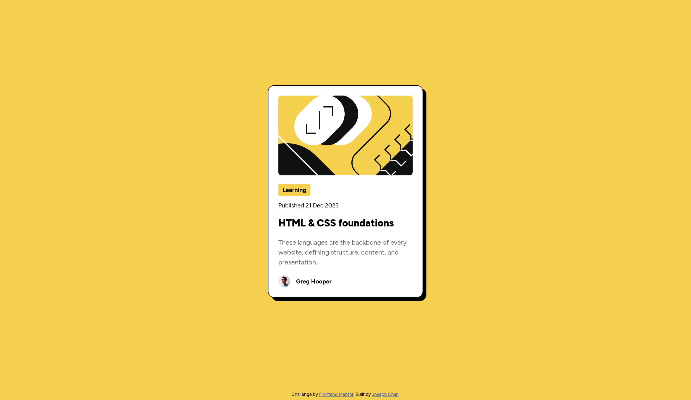

# Frontend Mentor - Blog preview card solution

This is a solution to the [Blog preview card challenge on Frontend
Mentor](https://www.frontendmentor.io/challenges/blog-preview-card-ckPaj01IcS).

## Table of contents

- [Frontend Mentor - Blog preview card solution](#frontend-mentor---blog-preview-card-solution)
  - [Table of contents](#table-of-contents)
  - [Overview](#overview)
    - [The challenge](#the-challenge)
    - [Screenshot](#screenshot)
    - [Links](#links)
  - [My process](#my-process)
    - [Built with](#built-with)
    - [What I learned](#what-i-learned)
  - [Author](#author)

## Overview

### The challenge

Users should be able to:

- See hover and focus states for all interactive elements on the page

Check out the [live
link](https://jchanke.github.io/frontend-mentor/blog-preview-card-main) and
hover over the blog title!

### Screenshot



### Links

- Solution URL: [Add solution URL here](https://your-solution-url.com)
- Live Site URL:
  [https://jchanke.github.io/frontend-mentor/blog-preview-card-main](https://jchanke.github.io/frontend-mentor/blog-preview-card-main)

## My process

### Built with

- Semantic HTML5 markup
- CSS custom properties
- Flexbox
- Mobile-first workflow

### What I learned

I learnt to use the `:hover` pseudo-class: 

```css
h2.blog-title {
  margin: 0;
  font-weight: 800;
  cursor: pointer;
}

h2.blog-title:hover {
  color: var(--page-bg);
}
```

## Author

- GitHub - [Joseph Chan](https://github.com/jchanke)
- Frontend Mentor -
  [@jchanke](https://www.frontendmentor.io/profile/jchanke)
