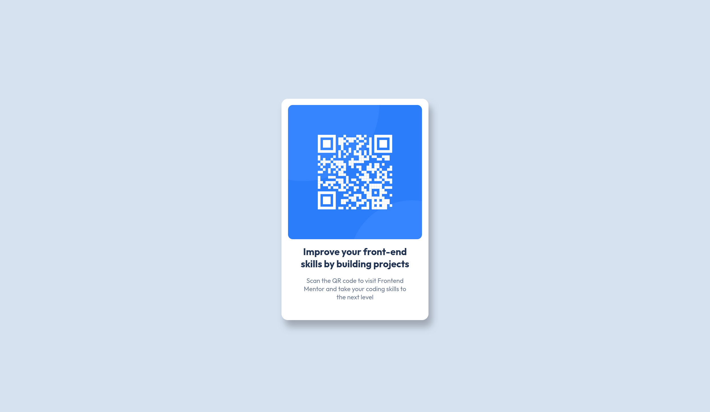

# Frontend Mentor - QR code component 

This is a solution to the [QR code component challenge on Frontend
Mentor](https://www.frontendmentor.io/challenges/qr-code-component-iux_sIO_H).

## Table of contents

- [Frontend Mentor - QR code component](#frontend-mentor---qr-code-component)
  - [Table of contents](#table-of-contents)
  - [Overview](#overview)
    - [Screenshot](#screenshot)
  - [My process](#my-process)
    - [Built with](#built-with)
    - [What I learned](#what-i-learned)
    - [Useful resources](#useful-resources)
  - [Author](#author)

## Overview

### Screenshot



## My process

### Built with

- CSS custom properties
- Flexbox
- Mobile-first workflow

### What I learned

_Responsive design._ I learnt to design for mobile first, then adjust the look
and feel for wider breakpoints. In this case, media queries weren't necessary:
the main idea was to use a horizontally-centered, full-height flex-container
and situate the elements inside it:

```css
.container {
  /* Center horizontally with max-width and margins + use 100% height */
  min-height: 100vh; /* 100% of the viewport height */
  max-width: var(--mobile); /* expand up to mobile size */
  margin: 0 auto; /* top-bottom margin = 0; left-right margin equal */
  
  /* Flex-container */
  display: flex;
  flex-direction: column;
  align-items: center; /* centers the card element vertically */
  justify-content: center;
}
```

Using `min-height: 100vh` ensures the content uses at least the viewport height.
The advantage over `height: 100%` is that it creates a scroll bar if the content
overflows.

_Box shadows._ This [helpful blog post by Josh
Comeau](https://www.joshwcomeau.com/css/designing-shadows/) explains the theory
behind why we use shadows (to create the illusion of elevation), but also how
we'd use them:

```css
.card {
  box-shadow: 8px 16px 16px hsl(0deg 0% 0% / 0.25); /* hsl with alpha = 0.25 */
  ...
}
```
The key: have a single degree of freedom (the 'elevation'), and have everything
else follow:
 - horizontal offsets (`8px 16px`) should scale together,
 - as should the border radius (`16px`) 
 - and the shadow opacity (`/ 0.25`).

### Useful resources

- [Designing Beautiful Shadows in
  CSS](https://www.joshwcomeau.com/css/designing-shadows/) by Josh Comeau.

## Author

- GitHub - [Joseph Chan](https://github.com/jchanke)
- Frontend Mentor - [@jchanke](https://www.frontendmentor.io/profile/jchanke)
