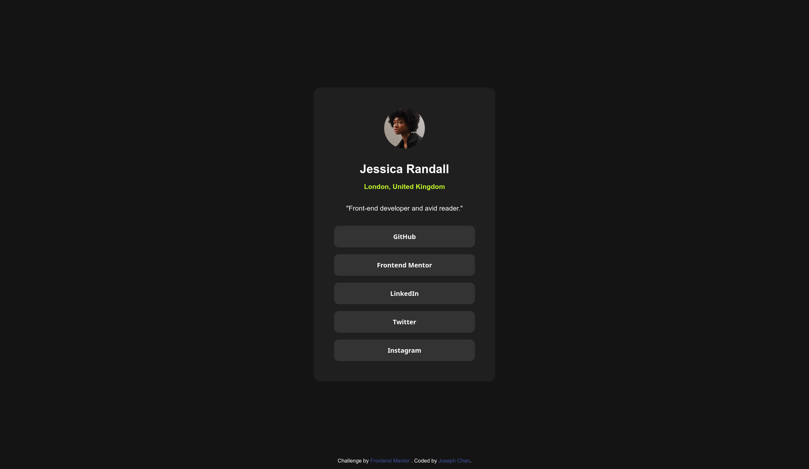

# Frontend Mentor - Social links profile solution

This is a solution to the [Social links profile challenge on Frontend
Mentor](https://www.frontendmentor.io/challenges/social-links-profile-UG32l9m6dQ).

## Table of contents

- [Frontend Mentor - Social links profile solution](#frontend-mentor---social-links-profile-solution)
  - [Table of contents](#table-of-contents)
  - [Overview](#overview)
    - [The challenge](#the-challenge)
    - [Screenshot](#screenshot)
    - [Links](#links)
  - [My process](#my-process)
    - [Built with](#built-with)
    - [What I learned](#what-i-learned)

## Overview

### The challenge

Users should be able to:

- See hover and focus states for all interactive elements on the page

### Screenshot



### Links

- Solution URL: [on Frontend
  Mentor](https://www.frontendmentor.io/solutions/responsive-social-media-profile-links-card)
- Live Site URL: view at
  [https://jchanke.github.io/frontend-mentor/social-links-profile-main](https://jchanke.github.io/frontend-mentor/social-links-profile-main)

## My process

### Built with

- Semantic HTML5 markup
- CSS custom properties
- Flexbox
- CSS Grid
- Mobile-first workflow

### What I learned

_Importing local fonts,_ using `@font-face`:

```css
@font-face {
  font-family: "Inter";
  src: url("assets/fonts/Inter-VariableFont_slnt\,wght.ttf") format("ttf");
  font-weight: 100 900;
  font-style: normal;
  font-display: swap;
}
```

_Using `box-sizing: border-box`._ This makes the card expand up to the
container's inner (horizontal) padding.

_`align-items: stretch`_ to make the buttons equally-sized.

_CSS nesting with the `&:hover`, `&:focus` syntax_ for better organization.

_Disabling the default `:hover` behaviour_ with `outline: none`.